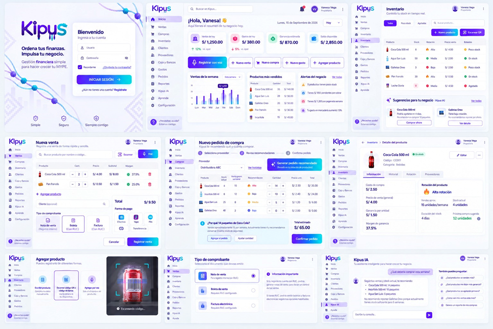

Año de la Esperanza y el Fortalecimiento de la Democracia.”

INSTITUTO DE EDUCACIÓN SUPERIOR PRIVADO “FIBONACCI”
PROGRAMA DE ESTUDIOS ADMINISTRACION DE EMPRESAS

“PROYECTO  DE INNOVACION:  SOFTWARE KIPUS ERP”
CURSO
INNOVACION II
CICLO
VI
DIRIGIDO POR:
ECON. RONALD ANDRADE ENCISO
INTEGRANTES
NAMUCHE RUIZ DARWIN MARTIN
PASTOR FASANADO TERRY RAUL
RAMIREZ LINO PIERINA MIJHAYLA
MURIEL SHUPINGAHUA JUAN LENIN

TINGO MARIA – 2026
ÍNDICE	
RESUMEN EJECUTIVO	___
INTRODUCCIÓN	
CAPÍTULO I.
1.	PROTOTIPADO Y PRUEBA DE CONCEPTO
1.1.	 Definición del prototipo físico, digital o funcional 
El prototipo de KIPU’S es un modelo digital y operativo de un Software ERP, esta alternativa tecnológica. Será específicamente diseñada para optimizar la gestión administrativa de las pequeñas y microempresas (MYPES) en la ciudad de Tingo María. La propuesta de este proyecto surge como una solución directa a las ineficiencias generadas del registro manual de datos, una práctica común en la región que suele generar retrasos, errores operativos y serias dificultades para acceder a la información actualizada en tiempo real. 
En este sentido KIPU’S está orientado principalmente a los propietarios y administradores de MYPES del sector comercial y de servicios. Los usuarios requieren de una herramienta intuitiva, accesible y de rápida implementación para organizar sus procesos internos esenciales. Para cumplir con este propósito, el prototipo incorpora una interfaz de navegación fluida que facilita el registro, la consulta y el control de las operaciones diarias.
Además, al ser una solución compactible con dispositivos móviles, permite a los encargados monitorear el estado de sus negocios y acceder a datos claves en cualquier momento y lugar, mejorando de manera integral la toma de decisiones.

1.2.	 Características técnicas y funcionales
	KIPU’S conformará un Software ERP, cuyo objetivo es facilitar los procesos de las MYPES. La propuesta presenta una plataforma fácil de usar y accesible para que los usuarios puedan manejar sus funciones desde su equipo móvil o dispositivos informáticos. El software integrará la información del negocio.
Entre sus características principales, permitirán gestionar ventas e inventario, registrar gastos, observar el flujo de caja y crear reportes automáticos, ofreciendo un panorama ordenado de las operaciones, ayudando a disminuir el trabajo manual, la perdida de información y los errores en los registros. Asimismo, los usuarios tendrán la capacidad de revisar los resultados actualizados para evaluar las operaciones.
Desde el punto de vista técnico, KIPU’S incluirá tecnología de reconocimiento de voz para facilitar el registro de ventas para disminuir el registro manual de la información con IA, contará con un sistema de almacenamiento que mantendrá los datos del negocio, un panel de indicadores que presentará de manera resumida y fácil de entender la información sobre el rendimiento del negocio y tomar la mejor decisión.
El prototipo atenderá las necesidades de los dueños, administradores, encargados de las MYPES en Tingo María, priorizando la facilidad de uso y la accesibilidad. La propuesta incluirá capacitación y acompañamiento para garantizar una correcta implementación. En conjunto, KIPU’S busca mejorar los procesos administrativos, aumentar la disponibilidad de información confiable y promover una gestión empresarial más organizada, eficiente y eficaz.

1.3.	 Herramientas, materiales y recursos utilizados
Para la elaboración del prototipo de KIPU’S, se harán uso de herramientas digitales centradas en el diseño, la creación y la estructuración de software. Entre estas herramientas se encuentran las que sirven para diseñar interfaces, desarrollar módulos y crear elementos visuales que formarán parte de la aplicación. Estas herramientas facilitarán una representación clara de la arquitectura y el funcionamiento de KIPU’S antes de su implementación final.                                                          
En cuanto a los recursos tecnológicos, se utilizarán ordenadores y dispositivos móviles que cuenten con acceso a Internet para la creación, revisión y prueba del prototipo. Además, se requerirá un entorno de desarrollo para llevar a cabo la programación de l software, así como recursos tecnológicos que ayuden en el almacenamiento y organización de datos relacionados con ventas, inventarios, gastos y flujos de caja. También se considerarán los recursos necesarios para la integración de las funciones de reconocimiento de voz y de inteligencia artificial que se han propuesto en el prototipo.
Los materiales utilizados estarán esencialmente relacionados con la organización, elaboración y documentación del proyecto. Se hará uso de plantillas de diseño, diagramas de navegación, ilustraciones de las interfaces y documentos de trabajo que ayudarán a estructurar las funcionalidades de KIPU’S. Estos materiales facilitarán la organización de los módulos, establecer el trayecto del usuario y hacer modificaciones durante la fase de desarrollo del prototipo.  Por último, en cuanto a los recursos humanos, se incluye la participación del equipo encargado del proyecto, que se ocupa del diseño, desarrollo, gestión y evaluación del prototipo, junto con la posterior implicación de dueños y administradores de MYPES para realizar pruebas de funcionamiento. La colaboración de estos recursos permitirá crear y valorar una versión preliminar de KIPU’S, detectando posibles obstáculos y áreas de mejora antes de proceder a su validación con los usuarios.
1.4.	 Procesos de construcción o desarrollo del prototipo
La evolución de construcción del modelo de KIPU’S se inició a partir de las singularidades técnicas y eficaz anticipadamente establecidas, considerando la exigencia de los empresario y administradores de las MYPES de Tingo María. En esta primera fase se determinó la organización general del software, estructurar los módulos y constituir la forma de interacción del consumidor con el sistema, con la determinación de lograr una herramienta fácil, accesible y practico.
luego, el crecimiento el diseño de la interfaz de consumidor, considerando un reparto claro del componente y una navegación sutil desde dispositivos móviles. A partir de esta organización se arrancar con la implementación avanzando de los módulos conectados con la dirección administrativa, incorporar los componentes imprescindibles para estructurar y conectar la comunicación difundir por la ejecución del negocio.
En un tercer periodo, se integraron las funciones tecnológicas apreciar en el planteamiento, específicamente el estudio de voz y el mecanismo de Inteligencia Artificial. Estas funcionalidades fueron incorporadas con el sistema de acopio y ordenamiento de datos, permitiendo tratar la información registrada y propagar elementos de soporte para el rastreo de las actividades administrativas, como nota y reportes.

Finalmente se desarrollaron pruebas preparatorio para examinar la marcha de la aplicación y la interacción entre sus distintos elementos. Mientras este periodo se determina y subsana posibles fallos u obstáculo de uso mediante adaptación continuo. Como conclusión, se logra una excelente versión funcional de KIPU’S, que ayudara como base para la elaboración de la verificación de noción y la siguiente valoración con los consumidores del segmento final.
1.5.	 Diseño y ejecución de la prueba de concepto 
La validación inicial de KIPU’S se llevará a cabo con el objetivo de verificar, de manera preliminar, si el modelo puede realizar las funciones fundamentales propuestas para asistir en la administración de las MYPES de Tingo María. Esta validación se llevará a cabo a través de la recreación de situaciones comunes en un negocio, tales como registrar una venta, examinar el inventario, gestionar los gastos y buscar recomendaciones de compra.
El análisis se centrará en el desempeño general del modelo, la facilidad para navegar en sus herramientas y la comprensión de sus funcionalidades principales. En esta fase, no se recopilarán resultados definitivos ni se evaluará la aceptación por parte de los usuarios, ya que esos datos se obtendrán posteriormente durante el proceso de validación.

Elemento	Descripción
Tipo de prueba	Prueba funcional preliminar del prototipo digital.
Producto evaluado	Software ERP KIPU’S.
Propósito	Revisar si las funciones principales pueden utilizarse de manera clara y ordenada.
Lugar previsto	MYPES del distrito de Rupa Rupa, Tingo María.
Modalidad	Demostración y simulación de operaciones administrativas.
Participantes	Integrantes del equipo del proyecto y, posteriormente, usuarios relacionados con las MYPES.
Duración estimada	De acuerdo con el cronograma establecido para el proyecto.
Resultado esperado	Identificar dificultades y oportunidades de mejora antes de la validación final.
Tabla 1: Diseño general de la prueba de concepto de KIPU’S

La evaluación se llevará a cabo empleando las interfaces creadas para KIPU’S, incluyendo la pantalla de acceso, el tablero central, la anotación de ventas, el stock, las solicitudes de compra, la información de productos, el control de gastos y la inteligencia artificial de KIPU’S. Estas plataformas facilitarán la simulación del proceso que un usuario experimentaría al interactuar con el sistema.

Imagen 1: Diseño de KIPU’S

1.5.1.	Supuesto de la prueba de concepto
Si KIPU´S unifica en una única plataforma las labores de ventas, administración de inventarios, gastos, informes y atención telefónica, podrá asistir a las MYPES en la optimización de sus procedimientos y en la reducción del tiempo destinado a la introducción manual de datos.

Tabla 2: Escenarios Funcionales de la prueba 
Escenario	Función que se revisará	Resultado esperado
Inicio de sesión	Ingreso del usuario al sistema	Acceder al panel principal de manera sencilla.
Registro de venta	Ingreso de productos, cantidades y precios	Registrar la operación y mostrar el total correspondiente.
Tipo de comprobante	Selección de nota de venta, boleta o factura	Mostrar la opción adecuada según la información del negocio.
Control de inventario	Consulta de productos, stock y rotación	Mostrar la disponibilidad y el estado de cada producto.
Registro de gastos	Ingreso de gastos del negocio	Mantener un control básico de los egresos.
Reportes administrativos	Consulta de ventas, gastos y ganancias	Presentar la información de manera resumida y comprensible.
Pedido recomendado	Revisión de sugerencias de compra	Proponer productos y cantidades según su rotación y stock.
Reconocimiento de voz	Registro de información mediante voz	Facilitar el ingreso de datos y reducir la escritura manual.
KIPU’S IA	Consulta de recomendaciones para el negocio	Brindar sugerencias relacionadas con ventas, productos e inventario.

1.5.2.	Procedimientos
Etapa	       Actividades previas
Planificación	•	Se verificará que la disposición de las pantallas y módulos del prototipo sea la correcta.
•	Se elegirán las operaciones que se van a simular.
•	Se determinarán los elementos que se van a observar durante la prueba.
•	Se generarán datos ficticios relacionados con productos, ventas, gastos e inventario.
Desarrollo de la prueba	•	Se presentará brevemente el objetivo y las principales funciones de KIPU’S.
•	Se simulará el acceso al sistema usando el nombre de usuario y la contraseña.
•	Se llevará a cabo un registro de ventas con productos y cantidades específicas.
•	Se evaluará el inventario y la condición de los productos.
•	Se registrará un gasto y se analizará su efecto en la información del negocio.
•	Se examinarán los informes y se harán recomendaciones de compra.
•	Se intentará el registro mediante comandos de voz, siempre que dicha función esté disponible en el prototipo.
Revisión  	•	Se documentarán las dificultades experimentadas durante el proceso.
•	Se comprobará si la información se presenta de manera clara y estructurada.
•	Se identificarán las funciones que requieran modificaciones.
•	Se ordenarán las observaciones para su uso en la fase de validación.
Tabla 3: Procedimientos para la ejecución 

1.5.3.	Aspectos que se observaran
Tabla 4: Aspectos 
Aspectos 	Observación 
Funcionamiento	Si las funciones principales operan como se anticipó.
Facilidad de uso	Si el usuario comprende los botones, menús y opciones disponibles.
Organización	Si la información sobre ventas, gastos e inventario está bien estructurada.
Tiempo de registro	Si se puede ingresar una operación de manera veloz.
Acceso	 Si el prototipo se puede visualizar adecuadamente en los dispositivos indicados.
Comprensión de reportes	Si los datos presentados son fáciles de interpretar.
Utilidad de las recomendaciones	Si las sugerencias de compra ofrecen información útil para el negocio.
 

1.5.4.	Instrumentos de registro 
Para reunir las observaciones de la evaluación se emplearán las siguientes herramientas:
• Hoja de observación del desempeño del prototipo.
• Control de verificación de las funcionalidades analizadas.
• Registro de problemas o fallos detectados.
• Imágenes de las pantallas mostradas durante la prueba.
• Formato conciso de retroalimentación de los participantes, si es necesario.
1.6.	 Evidencias y resultados iniciales del prototipo
En esta etapa del prototipo de KIPU’S, nos enfocaremos en registrar detalladamente cada una de las pruebas realizadas a lo largo de las distintas fases de su elaboración y evaluación. El objetivo principal del proyecto es comprobar que las funciones planeadas se estén incorporando de forma correcta. Para ello, recopilaremos material visual y descriptivo como bocetos de las pantallas, la estructura de los menús y el funcionamiento de las herramientas creadas de tal manera, mediremos los avances en las opciones operativas esenciales y en los complementos avanzados que logren implementarse con éxito.
Las primeras evidencias servirán para analizar de cerca el rendimiento de nuestro sistema y confirmar la viabilidad de nuestra idea. Nos centraremos en verificar si el diseño permite un uso intuitivo, si ayuda a ordenar la información de manera lógica y si realmente reduce los errores asociados con el control manual de las tareas de gestión. Cabe recalcar que en este punto no se medirán niveles de aceptación ni de conformidad, con el público, ya que estas métricas se guardarán para las fases posteriores, asegurando que los reportes finales se basen en datos técnicos totalmente reales.
Finalmente, toda la información que lograremos reunir en este periodo lo utilizaremos como base para detectar fallas y realizar los ajustes necesarios antes de pasar a las revisiones directas con el grupo de usuarios finales. Este proceso es fundamental para la optimizar la plataforma y garantizar un producto sólido, lo cual abrirá paso al desarrollo del siguiente capitulo formal de la investigación.

CAPÍTULO II. 
2. VALIDACIÓN Y ANÁLISIS DE RESULTADOS
2.1.	Objetivo de la validación
El propósito de la validación es evaluar la operatividad, simplicidad de uso y efectividad del prototipo digital KIPU’S como un recurso tecnológico para mejorar la administración de las (MYPES) en la ciudad de Tingo María. Con esta validación se posibilitará conocer si las funciones propuestas satisfacen las necesidades de los propietarios emprendedores.
Además, se busca evaluar como interactúan los usuarios con los módulos del Software ERP. Optimizando desde el seguimiento de ventas e inventarios hasta el control de gastos, el flujo de efectivo y la automatización de reportes. Se tendrá en cuenta la facilidad para acceder a la información actualizada y la interpretación de los datos presentados por el sistema.
Con la validación se detectará alguna dificultad, fallos u oportunidades de mejora durante el uso del prototipo, especialmente en áreas que involucran la navegación, registro de datos y comprensión de las funciones. Así se recopilará información valiosa para llevar a cabo los ajustes técnicos y funcionales necesarios antes de la implementación.
Finalmente se busca establecer el grado de aceptación y percepción de utilidad de KIPU’S entre los usuarios participantes, verificando si la propuesta ayude a disminuir el trabajo manual, reducir errores en los registros y facilitar una gestión empresarial más ordenada, eficiente y eficaz.

2.2.	Selección de usuarios, clientes o beneficiarios
La identificación de los usuarios, clientes y beneficiarios de KIPU'S se llevará a cabo teniendo en cuenta las características y demandas del público al que se destina la iniciativa. El grupo principal estará integrado por dueños, gerentes y responsables de micro y pequeñas empresas situadas en el distrito de Rupa Rupa, Tingo María, principalmente de los sectores comercial y de servicios.
Se tomarán en cuenta a quienes participen de forma directa en la documentación de ventas, control de inventarios, gestión de ingresos y egresos, y análisis de datos para la toma de decisiones. Además, se incluirán negocios que actualmente recurren a cuadernos, registros manuales u otros métodos básicos para ordenar sus operaciones.
Entre los posibles beneficiarios se hallarán propietarios o responsables de tiendas, farmacias, papelerías, restaurantes, cafeterías, minimarkets y otros pequeños emprendimientos familiares. Estos usuarios dispondrán de funciones como la documentación de ventas, control de productos, generación de informes, seguimiento de egresos y sugerencias de compra según la rotación del inventario.
La elección será deliberada, ya que se considerará a personas que estén directamente involucradas en la gestión de una MYPE y que puedan ofrecer información sobre la facilidad de uso y la efectividad del prototipo. Los beneficiarios directos serán los dueños, gerentes y responsables de las MYPES, dado que KIPU'S buscará asistirlos en la organización de sus operaciones, disminuir el registro manual y acceder a información actualizada del negocio.

2.3.	Técnicas e instrumentos de validación
Para confirmar el prototipo de KIPU’S, se empleará una metodología de encuesta. Esta se realizará con dueños, gerentes y responsables de pequeñas y medianas empresas en Tingo María, con el objetivo de entender sus requerimientos y su perspectiva sobre una herramienta digital que facilite el registro de ventas, la gestión de inventarios, el control de gastos y la elaboración de informes.
El instrumento consistirá en un formulario de diez preguntas de tipo cerrado, cada una con cuatro opciones de respuesta. La encuesta se llevará a cabo luego de presentar las características fundamentales de KIPU’S.
ENCUESTA SOBRE KIPU’S

Marque una sola opción en cada pregunta:

1. ¿Actualmente registra las ventas de su negocio de manera manual?
☐ Nunca
☐ Algunas veces
☐ Casi siempre
☐ Siempre 
2. ¿Registrar las ventas manualmente le hace perder tiempo?
☐ Nunca
☐ Algunas veces
☐ Casi siempre
☐ Siempre 

3. ¿Ha tenido errores al registrar sus ventas, gastos o inventarios manualmente?
☐ Nunca
☐ Algunas veces
☐ Casi siempre
☐ Siempre 
4. ¿Considera necesario contar con una herramienta digital para registrar las ventas de su negocio?
☐ Nunca
☐ Algunas veces
☐ Casi siempre
☐ Siempre 
5. ¿Utilizaría una aplicación móvil para registrar sus ventas de manera rápida?
☐ Nunca
☐ Algunas veces
☐ Casi siempre
☐ Siempre 
6. ¿Estaría dispuesto(a) a registrar sus ventas mediante comandos de voz?
☐ Nunca
☐ Algunas veces
☐ Casi siempre
☐ Siempre 
7. ¿Considera útil que la aplicación genere reportes automáticos de las ventas de su negocio?
☐ Nunca
☐ Algunas veces
☐ Casi siempre
☐ Siempre 

8. ¿Considera importante que una aplicación permita controlar el inventario automáticamente?
☐ Nunca
☐ Algunas veces
☐ Casi siempre
☐ Siempre 
9. ¿Utilizaría una aplicación que permita controlar ingresos, gastos y flujo de caja?
☐ Nunca
☐ Algunas veces
☐ Casi siempre
☐ Siempre 
10. ¿Estaría dispuesto(a) a utilizar KIPU’S si fuera fácil de usar y tuviera un costo accesible?
☐ Nunca
☐ Algunas veces
☐ Casi siempre
☐ Siempre
2.4.	Aplicación de encuestas, entrevistas o pruebas piloto
2.5.	Organización y procesamiento de la información 
2.6.	Análisis e interpretación de los resultados 
2.7.	Retroalimentación de los participantes
2.8.	Identificación de mejoras necesarias 
3.2. Selección de usuarios, clientes o beneficiarios	___
PIA
3.3. Técnicas e instrumentos de validación	___
ENCUESTAS
3.4. Aplicación de encuestas, entrevistas o pruebas piloto	___
3.5. Organización y procesamiento de la información	___
3.6. Análisis e interpretación de los resultados	___
3.7. Retroalimentación de los participantes	___
3.8. Identificación de mejoras necesarias	___
CAPÍTULO IV. OPTIMIZACIÓN DE LA PROPUESTA	___
4.1. Priorización de hallazgos y oportunidades de mejora	___
4.2. Ajustes técnicos, funcionales o de servicio	___
4.3. Aplicación de metodologías ágiles de mejora	___
4.4. Actualización de la propuesta de valor	___
4.5. Ajuste del modelo de negocio o Business Model Canvas	___
4.6. Versión mejorada del proyecto y control de cambios	___
CAPÍTULO V. COMERCIALIZACIÓN Y ESCALABILIDAD	___
5.1. Análisis del mercado y público objetivo	___
5.2. Identificación de competidores y alternativas existentes	___
5.3. Estrategia de posicionamiento y diferenciación	___
5.4. Canales de comunicación, difusión y comercialización	___
5.5. Estrategia de precios o sostenimiento del servicio	___
5.6. Plan de lanzamiento o introducción al mercado	___
5.7. Alianzas estratégicas y oportunidades de expansión	___
5.8. Estrategia de escalabilidad del proyecto	___
CAPÍTULO VI. EVALUACIÓN DEL IMPACTO DEL PROYECTO	___
6.1. Objetivo y metodología de evaluación	___
6.2. Indicadores de impacto y línea de referencia	___
6.3. Evaluación del impacto social	___
6.4. Evaluación del impacto económico	___
6.5. Evaluación del impacto ambiental	___
6.6. Análisis de resultados e interpretación de evidencias	___
6.7. Beneficios, limitaciones y oportunidades de mejora	___
CAPÍTULO VII. FINANCIAMIENTO Y PLAN DE INVERSIÓN	___
7.1. Identificación de recursos y necesidades financieras	___
7.2. Presupuesto detallado del proyecto	___
7.3. Costos de implementación, operación y mantenimiento	___
7.4. Fuentes y alternativas de financiamiento	___
7.5. Plan de inversión y proyección económica	___
7.6. Estrategia de negociación y obtención de financiamiento	___
7.7. Viabilidad económica y sostenibilidad financiera	___
CAPÍTULO VIII. PROPIEDAD INTELECTUAL Y PROTECCIÓN	___
8.1. Identificación de los componentes protegibles	___
8.2. Alternativas de protección intelectual aplicables	___
8.3. Marcas, derechos de autor, patentes u otros registros	___
8.4. Titularidad, autoría y acuerdos de colaboración	___
8.5. Confidencialidad y uso responsable de la información	___
8.6. Estrategia preliminar de registro y protección	___
CAPÍTULO IX. IMPLEMENTACIÓN Y SOSTENIBILIDAD	___
9.1. Objetivo y estrategia de implementación	___
9.2. Etapas y actividades de puesta en marcha	___
9.3. Cronograma y responsables	___
9.4. Recursos humanos, materiales y tecnológicos	___
9.5. Integración del proyecto en el entorno profesional	___
9.6. Riesgos de implementación y medidas de mitigación	___
9.7. Seguimiento, mantenimiento y control de resultados	___
9.8. Sostenibilidad económica, social y ambiental	___
CAPÍTULO X. RESULTADOS FINALES Y MEJORA CONTINUA	___
10.1. Resultados finales de la implementación o prueba piloto	___
10.2. Evidencias del cumplimiento de objetivos	___
10.3. Valoración de la viabilidad e impacto del proyecto	___
10.4. Retroalimentación final y ajustes pendientes	___
10.5. Plan de mejora continua y proyección futura	___
10.6. Reflexión sobre el proceso de innovación	___
CONCLUSIONES	___
RECOMENDACIONES	___
REFERENCIAS BIBLIOGRÁFICAS	___
ANEXOS	___
Anexo A. Síntesis del informe desarrollado en Innovación I	___
Anexo B. Matriz de ajustes y reformulación de objetivos	___
Anexo C. Ficha técnica y representación del prototipo	___
Anexo D. Fotografías, capturas o evidencias del desarrollo	___
Anexo E. Plan de prueba de concepto o prueba piloto	___
Anexo F. Encuestas, entrevistas y fichas de validación	___
Anexo G. Resultados procesados y registro de participantes	___
Anexo H. Informe de validación y retroalimentación	___
Anexo I. Registro de mejoras y control de cambios	___
Anexo J. Business Model Canvas actualizado	___
Anexo K. Plan de comercialización y escalabilidad	___
Anexo L. Matriz de evaluación del impacto	___
Anexo M. Presupuesto detallado y plan de financiamiento	___
Anexo N. Análisis de propiedad intelectual y protección	___
Anexo O. Cronograma y plan de implementación	___
Anexo P. Matriz de riesgos y análisis de sostenibilidad	___
Anexo Q. Evidencias de resultados y presentación final	___
Anexo R. Plan de mejora continua y reflexión final	___
